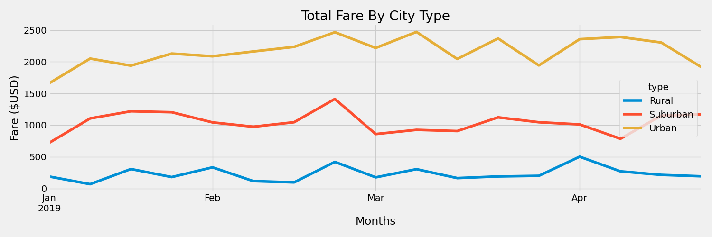

# PyBer_Analysis

## Overview of PyBer Analysis
The PyBer CEO tasked us with creating a multiple-line graph showing total weekly fares for Urban, Suburban, and Rural city types. This will give the PyBer decision makers insight into the total fares driven by each of the different city types over the first third of the 2019 year. We will create a summary DataFrame using Python and Pandas and then use Pandas and Matplotlib to create our graph. 

## Results of PyBer Analysis
Looking at the results of the PyBer analysis we can see that Urban rides provide most of the business's total ride demand and fare revenue. We can also see that Urban cities also have a significantly high excess of drivers for the overall ride demand. This deflates the average fare per driver for Urban cities vs. Rural and Suburban city types. Looking at the average fare, we can see that Rural and Suburban rides are more expensive per ride, this could be limiting the demand for rides with both Rural and Suburban total rides and total fares contributing significantly less despite the higher overall fare. In order to keep the PyBer ride share business strong we would like to see the demand for rides higher than the supply of drivers which is not the case for Urban cities but is the case for Rural and Suburban city types.

Looking at the multiple-line graph we can see that overall each city type doesn't change a lot week to week. There are peak weeks throughout the first third of the year but each week is within $1,000 in total fare which tells us that business is pretty consistent. The largest week overall (end of February) was within the top top 2 highest performances for all city types.

In order to strengthen overall performance of the business, PyBer should focus on making the Urban city rideshare program more efficient between rides and drivers, and should also focus on increasing the overall contribution of Rural and Suburban cities to the business. 

## Summary of PyBer Analysis
Based on the PyBer analysis the following recommendations are given to address the disparities among the city types.

1. PyBer should look into the mileage of each ride. Rural rides are likely longer which is part of the reason their average fare is higher. The opposite could be said for Urban rides because they are likely shorter on average. 
2. PyBer should focus its advertising investments on increasing Rural and Urban rides, with increasing Urban rides the largest focus. There is an excess of Urban drivers for the amount of rides taken, this could lead to some Urban drivers quitting due to lack of work. An increase in Rural rides would not only drive the highest fare increase per ride but also could attract more drivers to Rural rides.
3. PyBer could also benefit by finding a way to encourage some of their Urban drivers to take Suburban and Rural rides due to the lack of balance between the demand for Urban rides and supply of Urban drivers. Because the average fare of Rural rides are higher there might be room to offer Urban drivers that take on Rural rides an extra incentive. This will help keep the amount of drivers that PyBer has higher and more balanced for when PyBer experiences peaks in business during different parts of the year.
